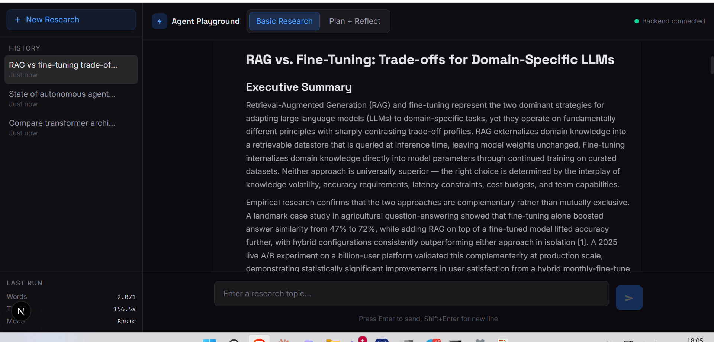
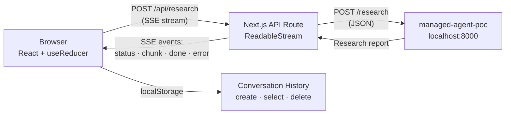

# Agent Playground

[](#tech-stack)
[](#tech-stack)
[](#tech-stack)
[](#features)
[](#architecture)
[](LICENSE)

**Interactive chat UI for AI research agents.** Connect to a managed-agent-poc backend and run basic or plan-and-reflect research workflows through a streaming real-time interface. Full conversation history, markdown rendering, run metadata, and dual agent modes — all in a responsive dark-theme interface.



## Table of Contents

- [Architecture](#architecture) — SSE streaming proxy pattern
- [Features](#features) — dual agents, streaming, markdown, history
- [Quick Start](#quick-start) — install and run in 3 commands
- [Agent Modes](#agent-modes) — basic vs plan-and-reflect
- [Tech Stack](#tech-stack) — Next.js 14, TypeScript, Tailwind v4
- [Project Structure](#project-structure) — component breakdown

## Architecture



The Next.js API route wraps the synchronous backend response in an SSE stream with typed progress events (`status`, `chunk`, `done`, `error`). The frontend consumes events through the Fetch API ReadableStream reader, updating the chat in real-time with streaming markdown.

## Features

- **Dual agent modes:** Basic single-pass research and Plan + Reflect iterative reasoning
- **SSE streaming:** Real-time progress events and chunked report delivery
- **Markdown rendering:** Headings, lists, code blocks, links, blockquotes (zero-dependency parser)
- **Conversation history:** Persisted in localStorage with create/select/delete
- **Run metadata:** Word count, elapsed time, and mode displayed per response
- **Backend health monitoring:** 30s polling with live status indicator
- **Responsive layout:** Desktop sidebar collapses to mobile hamburger
- **Copy reports:** One-click copy of agent output
- **Dark theme:** `#0a0a0f` background with Electric Blue accents
- **Error handling:** Backend offline, timeout (300s), and cancellation states
- **Accessibility:** `aria-live` on message stream, `:focus-visible` outlines, `<main>` landmark, skip-to-content

## Quick Start

**Prerequisites:** [managed-agent-poc](https://github.com/mj-deving/managed-agents-research) backend running on `http://localhost:8000`

```bash
# Install
npm install

# Development
npm run dev

# Production
npm run build && npm start
```

Runs on `http://localhost:3000`. Set `BACKEND_URL` to override the backend address.

## Agent Modes

| Mode | How It Works | Typical Runtime | Output |
|------|-------------|----------------|--------|
| **Basic** | Single-pass: query → research → report | 60–90s | ~4K words, 8–12 sources |
| **Plan + Reflect** | Plan → research → write → review → revise (iterative) | 120–180s | ~8K words, 15–20 sources, higher quality |

## Tech Stack

| Layer | Technology |
|-------|-----------|
| **Framework** | Next.js 14 (App Router) |
| **Language** | TypeScript (strict mode) |
| **Styling** | Tailwind CSS v4 |
| **Fonts** | Instrument Sans + Syne (Google Fonts) |
| **State** | `useReducer` + custom hooks |
| **Storage** | localStorage for conversation history |
| **Streaming** | Server-Sent Events via ReadableStream API |

## Project Structure

```
app/
  layout.tsx              Root layout with fonts and metadata
  page.tsx                Main playground (111 lines after extraction)
  globals.css             Tailwind + markdown + animation styles
  api/
    research/route.ts     SSE streaming proxy to backend
    health/route.ts       Backend health check endpoint
components/
  AgentSelector.tsx       Mode toggle (Basic / Plan+Reflect)
  ChatInput.tsx           Text input with send/cancel
  ChatMessage.tsx         Message bubble with avatar and metadata
  EmptyState.tsx          Welcome screen with suggestion cards
  Header.tsx              App header with status indicator
  MarkdownRenderer.tsx    Lightweight markdown-to-HTML converter
  MetadataSidebar.tsx     History list and run stats
  StreamingDisplay.tsx    Live streaming content with markdown
  ThinkingIndicator.tsx   Animated dots during agent processing
hooks/
  useResearchAgent.ts     SSE lifecycle, state reducer, localStorage
lib/
  types.ts                TypeScript type definitions
  markdown.ts             Zero-dependency markdown parser
  storage.ts              localStorage wrapper
```
